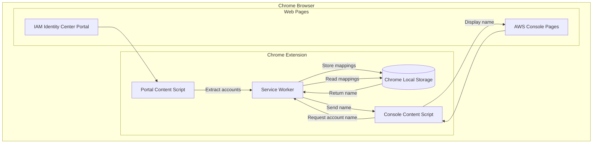

# Design Document

## Overview

This Chrome extension enhances the AWS IAM Identity Center experience by displaying human-readable account names alongside account numbers in the AWS Console. The extension operates in two modes:

1. **Capture Mode**: When the user visits the IAM Identity Center access portal, the extension extracts account name/number mappings from the page and stores them locally.

2. **Display Mode**: When the user navigates to any AWS Console page, the extension reads the current account number and displays the corresponding account name from storage.

The extension uses Chrome's Manifest V3 architecture with content scripts for page interaction and a background service worker for storage management.

## Architecture



### Component Interaction Flow

1. **Portal Scraping Flow**:
   - User visits IAM Identity Center access portal
   - Portal content script detects the page and extracts account data
   - Content script sends account mappings to service worker
   - Service worker persists mappings to Chrome local storage

2. **Console Display Flow**:
   - User navigates to AWS Console page
   - Console content script extracts current account number from page
   - Content script requests account name from service worker
   - Service worker retrieves name from storage and returns it
   - Content script injects account name display into page

## Components and Interfaces

### 1. Manifest Configuration (`manifest.json`)

Defines extension metadata, permissions, and script registrations.

```typescript
interface ManifestConfig {
  manifest_version: 3;
  name: string;
  version: string;
  permissions: ['storage'];
  host_permissions: [
    'https://*.awsapps.com/*',
    'https://*.aws.amazon.com/*'
  ];
  background: {
    service_worker: string;
  };
  content_scripts: ContentScriptConfig[];
}

interface ContentScriptConfig {
  matches: string[];
  js: string[];
  css?: string[];
  run_at: 'document_idle' | 'document_start' | 'document_end';
}
```

### 2. Service Worker (`background.js`)

Handles message passing and storage operations.

```typescript
interface AccountMapping {
  accountId: string;      // 12-digit AWS account number
  accountName: string;    // Human-readable account name
  lastUpdated: number;    // Timestamp of last update
}

interface StorageData {
  accounts: Record<string, AccountMapping>;  // Keyed by accountId
}

// Message types for communication
type MessageType =
  | { type: 'STORE_ACCOUNTS'; accounts: AccountMapping[] }
  | { type: 'GET_ACCOUNT_NAME'; accountId: string }
  | { type: 'CLEAR_DATA' };

interface MessageResponse {
  success: boolean;
  data?: string | null;  // Account name for GET_ACCOUNT_NAME
  error?: string;
}
```

### 3. Portal Content Script (`portal-content.js`)

Extracts account information from IAM Identity Center access portal.

```typescript
interface ExtractedAccount {
  accountId: string;
  accountName: string;
}

// Functions
function extractAccountsFromPortal(): ExtractedAccount[];
function observePortalChanges(callback: () => void): MutationObserver;
function sendAccountsToBackground(accounts: ExtractedAccount[]): Promise<void>;
```

### 4. Console Content Script (`console-content.js`)

Displays account name in AWS Console pages.

```typescript
// Functions
function getCurrentAccountId(): string | null;
function waitForAccountElement(): Promise<Element>;
function injectAccountNameDisplay(accountName: string, accountId: string): void;
function updateDisplayOnNavigation(): void;
```

### 5. Display Component (`display.css` + injection logic)

Styles for the account name display.

```typescript
interface DisplayConfig {
  maxNameLength: number;      // Characters before truncation
  tooltipDelay: number;       // Milliseconds before tooltip shows
  position: 'before' | 'after';  // Relative to account number
}
```

## Data Models

### Account Mapping Storage Schema

```typescript
interface AccountMapping {
  accountId: string;      // 12-digit AWS account number (e.g., "123456789012")
  accountName: string;    // Account name (e.g., "Production-US-East")
  lastUpdated: number;    // Unix timestamp in milliseconds
}

// Storage structure in Chrome local storage
interface StorageSchema {
  accounts: {
    [accountId: string]: AccountMapping;
  };
  version: number;  // Schema version for future migrations
}
```

### Message Protocol

```typescript
// Portal to Service Worker
interface StoreAccountsMessage {
  type: 'STORE_ACCOUNTS';
  accounts: Array<{
    accountId: string;
    accountName: string;
  }>;
}

// Console to Service Worker
interface GetAccountNameMessage {
  type: 'GET_ACCOUNT_NAME';
  accountId: string;
}

// Service Worker Response
interface AccountNameResponse {
  success: boolean;
  accountName: string | null;
  error?: string;
}
```

### DOM Element Selectors

```typescript
// Selectors for IAM Identity Center Portal
const PORTAL_SELECTORS = {
  accountList: '[data-testid="account-list"]',
  accountItem: '.account-item',
  accountName: '.account-name',
  accountId: '.account-id'
} as const;

// Selectors for AWS Console
const CONSOLE_SELECTORS = {
  accountInfo: '[data-testid="awsc-nav-account-menu-button"]',
  accountNumber: '.awsc-account-id'
} as const;
```


## Correctness Properties

*A property is a characteristic or behavior that should hold true across all valid executions of a system-essentially, a formal statement about what the system should do. Properties serve as the bridge between human-readable specifications and machine-verifiable correctness guarantees.*

Based on the acceptance criteria analysis, the following correctness properties must hold:

### Property 1: Display includes account name and number

*For any* stored account mapping with a valid account ID and name, when the display function is called with that account ID, the resulting display element SHALL contain both the account name and the account number.

**Validates: Requirements 1.1**

### Property 2: Tooltip contains complete information

*For any* account mapping, the tooltip element generated for that account SHALL contain both the complete (non-truncated) account name and the full 12-digit account number.

**Validates: Requirements 1.3**

### Property 3: Portal extraction correctness

*For any* valid portal HTML structure containing account entries, the extraction function SHALL return an array of account mappings where each extracted account ID matches the account ID in the source HTML and each extracted account name matches the account name in the source HTML.

**Validates: Requirements 2.1, 2.4**

### Property 4: Storage round-trip consistency

*For any* array of account mappings, storing the mappings and then retrieving them SHALL return equivalent account data (same account IDs mapped to same account names).

**Validates: Requirements 2.2, 3.1, 3.2**

### Property 5: Storage update overwrites previous state

*For any* initial set of account mappings followed by an updated set of account mappings, after storing both sequentially, retrieving the data SHALL return only the most recent state for each account ID.

**Validates: Requirements 2.3**

### Property 6: Clear removes all stored data

*For any* set of stored account mappings, after calling the clear function, retrieving account data SHALL return an empty result (no mappings).

**Validates: Requirements 3.3**

### Property 7: Long name truncation with full tooltip

*For any* account name exceeding the maximum display length, the displayed text SHALL be truncated with an ellipsis, AND the tooltip SHALL contain the complete untruncated account name.

**Validates: Requirements 5.2**

## Error Handling

### Portal Content Script Errors

| Error Condition | Handling Strategy |
|----------------|-------------------|
| Portal page structure changed | Log warning, attempt fallback selectors, fail gracefully without crashing |
| No accounts found on page | Log info message, do not update storage (preserve existing data) |
| Malformed account data | Skip invalid entries, process valid ones, log warnings |
| Message passing failure | Retry once, then log error and continue |

### Console Content Script Errors

| Error Condition | Handling Strategy |
|----------------|-------------------|
| Account number element not found | Wait with timeout (5s), then give up silently |
| Account ID not in storage | Display placeholder text "Unknown Account" |
| Storage read failure | Log error, display account number only |
| DOM injection failure | Log error, do not retry (avoid infinite loops) |

### Service Worker Errors

| Error Condition | Handling Strategy |
|----------------|-------------------|
| Storage quota exceeded | Log error, attempt to clear old entries |
| Invalid message format | Return error response, log warning |
| Storage API unavailable | Return error response to content scripts |

### Input Validation

```typescript
function isValidAccountId(id: string): boolean {
  return /^\d{12}$/.test(id);
}

function isValidAccountName(name: string): boolean {
  return typeof name === 'string' && name.length > 0 && name.length <= 256;
}

function sanitizeAccountName(name: string): string {
  return name.trim().substring(0, 256);
}
```

## Testing Strategy

### Testing Framework

- **Unit Testing**: Jest for JavaScript/TypeScript unit tests
- **Property-Based Testing**: fast-check library for generating test inputs

### Unit Tests

Unit tests will cover:

1. **Account ID validation** - Verify 12-digit validation logic
2. **Account name sanitization** - Verify trimming and length limits
3. **Display element creation** - Verify correct HTML structure
4. **Message handling** - Verify correct responses to each message type
5. **Edge cases** - Empty storage, missing elements, invalid data

### Property-Based Tests

Property-based tests will verify the correctness properties defined above:

1. **Storage round-trip** - Generate random account mappings, store and retrieve, verify equality
2. **Extraction correctness** - Generate valid HTML structures, extract, verify all accounts captured
3. **Display completeness** - Generate account data, create display, verify contains name and number
4. **Truncation behavior** - Generate long names, verify truncation and tooltip correctness
5. **Update semantics** - Generate sequences of updates, verify final state matches last update

### Test Configuration

```typescript
// fast-check configuration
const FC_CONFIG = {
  numRuns: 100,           // Minimum iterations per property
  seed: Date.now(),       // Reproducible with logged seed
  verbose: true           // Log failing examples
};
```

### Test File Structure

```
tests/
├── unit/
│   ├── validation.test.js
│   ├── storage.test.js
│   ├── display.test.js
│   └── messaging.test.js
├── property/
│   ├── storage.property.test.js
│   ├── extraction.property.test.js
│   └── display.property.test.js
└── fixtures/
    └── portal-html-samples.js
```
